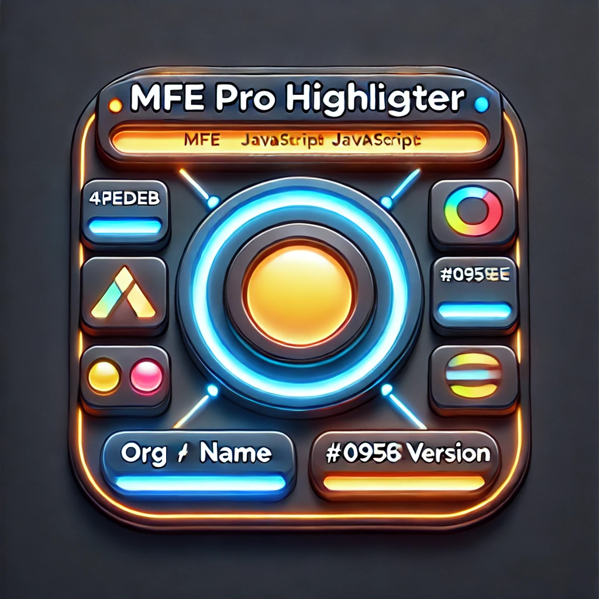

[](https://codecov.io/gh/mfe-pro/highlighter)

# MFE Pro Highlighter



**MFE Pro Highlighter** is a library to highlight micro frontend components with gradient borders and dynamic tooltips.

## How to Use

1. Import the script from jsDelivr:

```html
<script src="https://cdn.jsdelivr.net/npm/mfe-pro-highlighter@latest/dist/highlighter.min.js"></script>
```

2. Call the function to start the highlight:

```html
<script>
   MFEHighlighter.init({
      org: '@test',
      primaryColor: '#ff0000',
      secondaryColor: '#00ff00'
    });
</script>
```

## Customization

- **Org**: Name of your organization
- **Primary and Secondary Colors**: Pass the primary and secondary colors as parameters to customize the gradient border.
