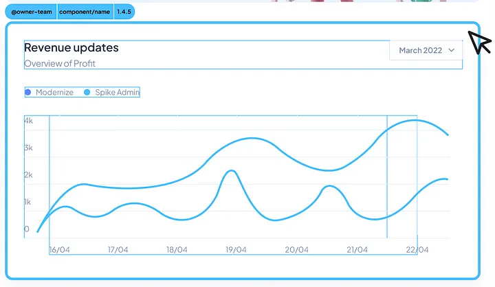

[](https://codecov.io/gh/mfe-pro/highlighter)

# MFE Pro Highlighter



**MFE Pro Highlighter** is a library to highlight micro frontend components with gradient borders and dynamic tooltips.

## How to Use

1. Import the script from jsDelivr:

```html

<script src="https://cdn.jsdelivr.net/npm/mfe-pro-highlighter@latest/dist/highlighter.min.js"></script>
```

2. Call the function to start the highlight:

```html

<div class="block" data-mfe-highlighter="true" data-mfe-name="my-package-name" data-mfe-owner="team-a"
     data-mfe-version="1.0.0">Test Element
</div>
<script>
  MFEHighlighter.init({
    org: '@test',
    barColor: 'red',
    fontColor: 'white',
    primaryColor: '#ff6995',
    secondaryColor: '#3ecdff',
    buttonActiveColor: '#ff6995',
    buttonInactiveColor: '#3ecdff',
    iconActiveColor: '#ffffff',
    iconInactiveColor: '#000000',
    autoInit: true
  });
</script>
```